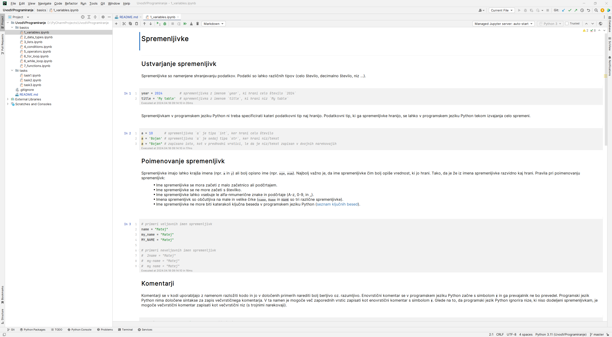

# FERI062 - Uvod v programiranje

Ta repozitorij je namenjen spoznavanju osnovnih konceptov programiranja v programskem jeziku Python. V
direktoriju [basics/](basics) so predstavljeni osnovni koncepti v posameznih interaktivnih beležkah. Za zagon posameznih
odsekov kode ni potrebna namestitev na vaš računalnik. Odseki kode so zapisani v interaktivnih beležkah, ki jih je
mogoče izvajati in spreminjati neposredno v brskalniku. Vsaka interaktivna beležka ima na koncu poglavje "Brane se
preizkusi", ki vsebuje kratke naloge s katerimi preverite svoje znanje. Dostopno na naslednji
povezavi: [https://mybinder.org/v2/gh/matejmoravec/feri062/HEAD](https://mybinder.org/v2/gh/matejmoravec/feri062/HEAD).

**Osnovni koncepti, ki so zajeti:**

- [Spremenljivke](basics/1_variables.ipynb)
- [Podatkovni tipi](basics/2_data_types.ipynb)
- [Seznami](basics/3_lists.ipynb)
- [Pogojni stavki](basics/4_conditions.ipynb)
- [Operatorji](basics/5_operators.ipynb)
- [Zanka `for`](basics/6_for_loop.ipynb)
- [Zanka `while`](basics/6_while_loop.ipynb)
- [Funkcije](basics/7_functions.ipynb)

V direktoriju [tasks/](tasks) se nahaja zbirka nalog, ki jih je mogoče rešiti s pomočjo znanja osnovnih konceptov
programiranja v programskem jeziku Python.

### Vzpostavitev okolja na svojem računalniku

1. Na svoj računalnik prenesite brezplačno dostopno integrirano razvojno okolje (IDE)
   [PyCharm](https://www.jetbrains.com/pycharm/download/download-thanks.html?platform=windows&code=PCC)
   za razvoj s programskim jezikom Python.
2. Ko je prenos končan, zaženite namestitveno datoteko (.exe) in sledite navodilom namestitve. Privzeto so izbrane vse
   potrebne komponente za namestitev. Izberite ciljni direktorij za namestitev, če želite spremeniti privzeto lokacijo.
3. Na svoj računalnik [s te povezave](https://github.com/matejmoravec/feri062/archive/refs/heads/master.zip) prenesite
   projekt iz tega repozitorija in ga razpakirajte na poljubno lokacijo.
4. Odprite PyCharm in v zgornjem meniju izberite "File" --> "Open..." ter v dialogu poiščite in izberite direktorij s
   projektom, ki ste ga v prejšnji točki prenesli iz tega repozitorija.
5. Na levi strani so prikazane interaktivne beležke. Posamezne celice v interaktivni beležki lahko zaganjate tako, da na
   vrhu beležke kliknete na zeleni trikotnik.

### Smernice pri uporabi interaktivnih beležk

#### Strukturiranje kode v programskem jeziku Python

V programskem jeziku Python so odmiki (tudi imenovani zamiki ali indentacije) izjemno pomembni, saj določajo strukturo
in logično hierarhijo kode. Odmiki se uporabljajo za označevanje blokov kode, kot so zanke, pogoji, funkcije in razredi.
Pomembno je upoštevati naslednje:

1. Struktura kode: Odmiki določajo, kateri deli kode spadajo v notranje bloke (npr. zanke, pogoji) in kateri so zunanji.
   To pomeni, da je struktura kode v programskem jeziku Python vizualno odvisna od odmikov.
2. Berljivost kode: Pravilna uporaba odmikov izboljšuje berljivost kode, saj omogoča, da se logika programa jasno
   razlikuje. S pravilno strukturirano kodo je lažje razumeti namen in delovanje programa.
3. Določanje obsega: Odmiki določajo obseg določenega bloka kode. Na primer, v programskem jeziku Python se telo zanke
   ali pogoja določi z ustreznim odmikom, kar pomeni, da vse, kar je zamaknjeno v notranjosti, spada v ta blok kode.
4. Skladnost s standardi: Pomembno je, da so odmiki v celotnem programu dosledni. Običajno se uporabljajo štirje
   presledki za en odmik ali en tabulator, vendar je ključno, da se ena metoda uporablja dosledno po celotni kodi.

Zato je pomembno, da se upošteva pravilno uporabo odmikov v programskem jeziku Python, saj to vpliva na berljivost,
strukturo in delovanje vaše kode.

#### Kako zagnati posamezno celico v interaktivni beležki?

1. Kliknite na celico s kodo, ki jo želite izvršiti.
2. Če želite izvršiti celico, pritisnite Shift + Enter ali kliknite na gumb "Run" (trikotnik) v zgornjem meniju.
3. Počakajte, da se izvrši koda v celici.
4. Rezultat izvedene kode (če obstaja) se bo prikazal pod celico.

#### Kako na svoj računalnik shraniti Jupyter Notebook (vključno z vnosi v celicah s kodo)?

1. Kliknite na "File" v zgornji vrstici menija.
2. Iz spustnega menija izberite "Download".
3. Izberite želeno mesto na računalniku in shranite Jupyter Notebook (.ipynb) na svoj računalnik.

### Kako nadgraditi usvojeno znanje?

- [Razširjen nabor nalog v programskem jeziku Python na platformi HackerRank](https://www.hackerrank.com/domains/python)
- [Brezplačno dostopno integrirano razvojno okolje (IDE) PyCharm za razvoj s programskim jezikom Python](https://www.jetbrains.com/pycharm/)

### Viri

- https://www.w3schools.com/python/
- https://gist.github.com/kenjyco/69eeb503125035f21a9d